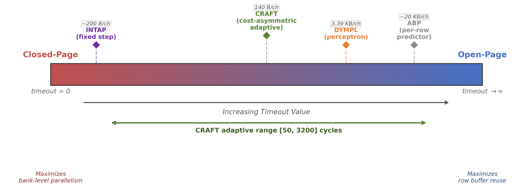

## 2. Background & Motivation

### 2.1 DRAM Row Buffer Fundamentals

Modern DRAM organizes each bank around a *row buffer*, a wide SRAM latch that holds the most recently activated row. The latency of a memory access depends critically on the state of this row buffer when the request arrives. As illustrated in Figure X(a), three scenarios arise:

- **Row buffer hit.** The requested data resides in the currently open row. The memory controller issues a column access command (CAS) directly, incurring only the column access latency tCAS. This is the fastest scenario.
- **Row buffer miss (closed bank).** No row is currently open. The controller must first activate the target row (ACT), then issue the CAS. The total latency is tRCD + tCAS.
- **Row buffer conflict.** A different row is open. The controller must first precharge the bank to close the current row (PRE), activate the target row, and then issue the CAS. This incurs the full penalty of tRP + tRCD + tCAS and represents the worst-case latency.

The disparity between these three scenarios motivates row buffer management policies. An *open-page* policy keeps the row buffer open after an access, betting on temporal locality within the same row to yield future hits at tCAS cost. A *closed-page* policy precharges the bank immediately after each access, eliminating conflict penalties at the expense of converting every subsequent access into a miss. Neither policy dominates universally: as shown in Figure X, the preferred policy varies across workloads, across execution phases within a single workload, and even across banks within a single execution.

**Timeout-based speculative precharge.** To navigate this trade-off, timeout-based policies occupy a middle ground on the policy spectrum (Figure Y). Rather than committing to a static decision, the memory controller starts a countdown timer when a row becomes idle. If the timer expires before the next request, the controller speculatively precharges the bank. This speculation produces one of three outcomes, illustrated in Figure X(b):

1. **Right precharge.** The next request targets a different row. The speculative precharge was correct and has eliminated a potential conflict penalty. The effective cost of the speculation is zero, since the precharge was necessary regardless.
2. **Wrong precharge.** The next request targets the same row that was just closed. The speculation was incorrect, forcing an unnecessary reactivation. The penalty is tRP + tRCD additional cycles compared to a row buffer hit.
3. **Conflict (on-demand precharge).** A request to a different row arrives before the timeout expires, requiring an on-demand precharge. The penalty relative to a right precharge is tRP, since a correctly timed speculative precharge would have absorbed this cost in advance.

The timeout value controls where a bank operates on the closed-to-open spectrum: a short timeout approximates closed-page behavior, while a long timeout approximates open-page behavior. The central challenge is to set this timeout value adaptively, per bank and over time, to match the evolving access pattern of each bank.

### 2.2 Limitations of Existing Adaptive Schemes

Several adaptive row buffer management schemes have been proposed to address this challenge. Table 1 summarizes three representative baselines that span the design space in terms of mechanism complexity and hardware cost.

**Table 1: Comparison of adaptive row buffer management baselines.**

| Scheme | Decision Mechanism | Storage per Channel | Critical-Path Computation | Key Limitation |
|--------|-------------------|--------------------|--------------------------|--------------------|
| ABP    | Per-row access count prediction table | ~20 KB | Table lookup + comparison | Prohibitive storage; per-row granularity cannot capture phase behavior |
| DYMPL  | Seven-feature perceptron + 512-entry page row table (PRT) | 3.39 KB | Seven table lookups + six additions | PRT accounts for 86.6% of storage; computational overhead on critical path |
| INTAP  | Mistake counter with fixed adjustment step | ~200 B | One comparison + one addition | No cost awareness; symmetric adjustment treats all errors identically |

ABP [Awasthi+11] maintains a per-row access counter to predict whether each row will be reaccessed, requiring approximately 20 KB of storage per channel in the form of a set-associative prediction table. While this fine-grained approach can capture row-level locality, its storage cost is impractical for modern DDR5 controllers with 32 banks per channel, and its per-row granularity prevents it from capturing bank-level phase transitions.

DYMPL [Rafique+22] employs a perceptron that combines seven extracted features—including page utilization, hotness, temporal locality, and column stride—to make open-or-close decisions at cluster boundaries. Although more compact than ABP, 86.6% of its 3.39 KB per-channel storage is consumed by a 512-entry page row table (PRT) used for feature extraction. The perceptron inference requires seven table lookups and six additions on the decision critical path, and the feature extraction itself introduces an indirection layer between observed events and the management decision.

INTAP uses a mistake counter with a fixed step size to adjust timeout values per bank. When the counter detects excessive precharge errors, the timeout is increased or decreased by a constant increment. At approximately 200 B per channel, INTAP is the most lightweight of the three baselines. However, its symmetric, fixed-step adjustment mechanism treats all precharge errors identically, regardless of their type or the magnitude of the resulting performance penalty.

### 2.3 Motivation: The Overlooked Cost Asymmetry

The three timeout precharge outcomes—right, wrong, and conflict—differ fundamentally in their performance impact, yet existing schemes either ignore this distinction entirely or address it only indirectly. We identify three dimensions of asymmetry that motivate the design of CRAFT.

**Observation 1: Wrong precharge and conflict incur different penalties, but existing timeout-based schemes adjust symmetrically.**

A wrong precharge forces the controller to reactivate the same row, wasting tRP + tRCD cycles. A conflict, by contrast, means the timeout was set too long and a demand precharge was needed, costing an additional tRP cycles relative to a correctly timed speculative precharge. Under DDR5-4800 timing, the wrong precharge penalty (80 cycles) is twice the conflict penalty (40 cycles). Despite this factor-of-two difference, INTAP's mistake counter does not distinguish between these two error types and applies the same fixed step size in both directions. This symmetric treatment fails to reflect the underlying cost structure: an overly aggressive precharge (wrong) is twice as expensive as an overly conservative one (conflict), and the adjustment policy should reflect this imbalance.

**Observation 2: Read and write wrong precharges have different performance impacts, but all existing schemes treat them uniformly.**

Not all wrong precharges impose the same cost on the processor. A read request that encounters a wrong precharge stalls the processor pipeline, as the core must wait for data to return before it can retire dependent instructions. A write request that encounters the same situation is absorbed by the write buffer and incurs minimal pipeline impact.

Empirically, this distinction is significant. Across 62 benchmarks, read operations account for 80.3% of all wrong precharge events, with a read-to-write ratio of 4.1 to 1. This ratio varies substantially across workloads: in PageRank on the higgs graph, read wrong precharges constitute 99.8% of all wrong precharge events, while in wrf, write wrong precharges are the majority at 56.5%. No existing scheme differentiates its response based on the read-or-write nature of the triggering request.

**Observation 3: Precharge outcomes are the most direct feedback signal, yet existing schemes rely on indirect features.**

DYMPL extracts seven features—page utilization, hotness, temporal locality, column stride, hit count, bank recency, and bank hit trend—as indirect proxies for predicting whether the row buffer should remain open. Each feature introduces an indirection: the perceptron must learn, through training, how these proxies correlate with the optimal decision. In contrast, the precharge outcome itself directly answers the question that the management policy seeks to resolve: was the timeout appropriate? A right precharge confirms the current timeout; a wrong precharge indicates it was too short; a conflict indicates it was too long. This direct correspondence between the observed event and the required adjustment direction eliminates the need for feature engineering, prediction tables, or learned models. CRAFT exploits this observation by using precharge outcomes—weighted by their asymmetric costs—as the sole feedback signal for timeout adaptation.
