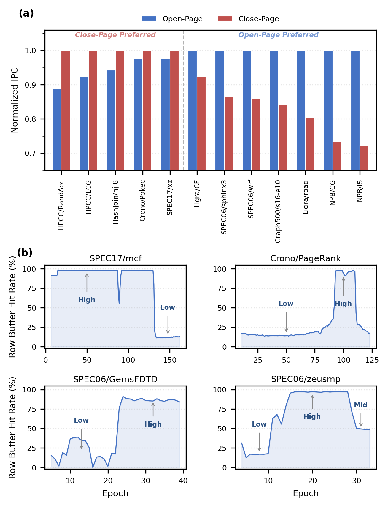
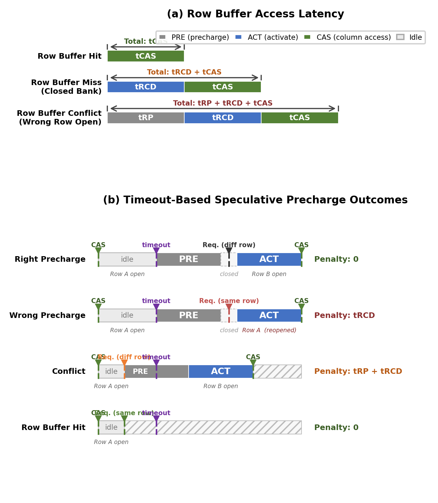
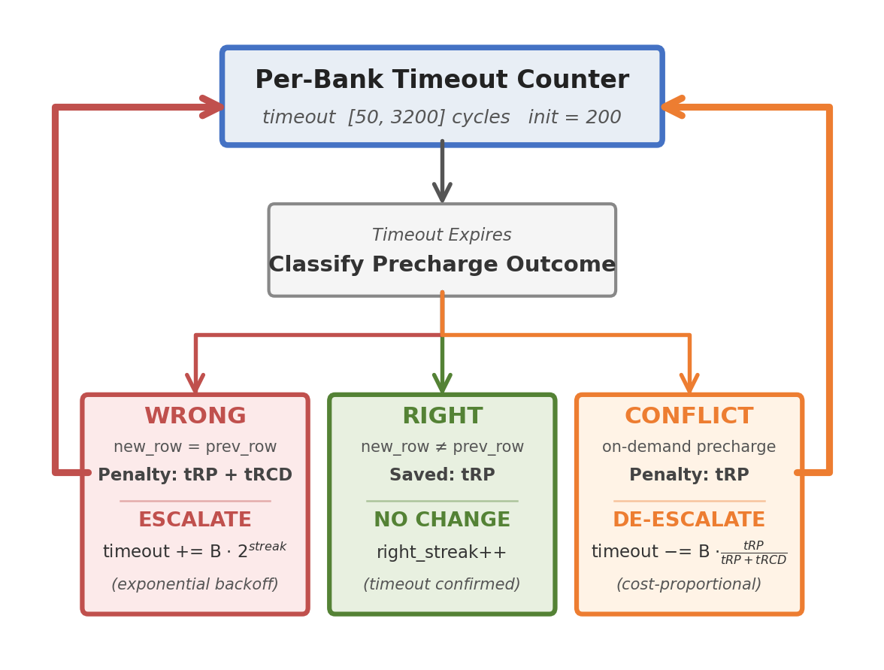
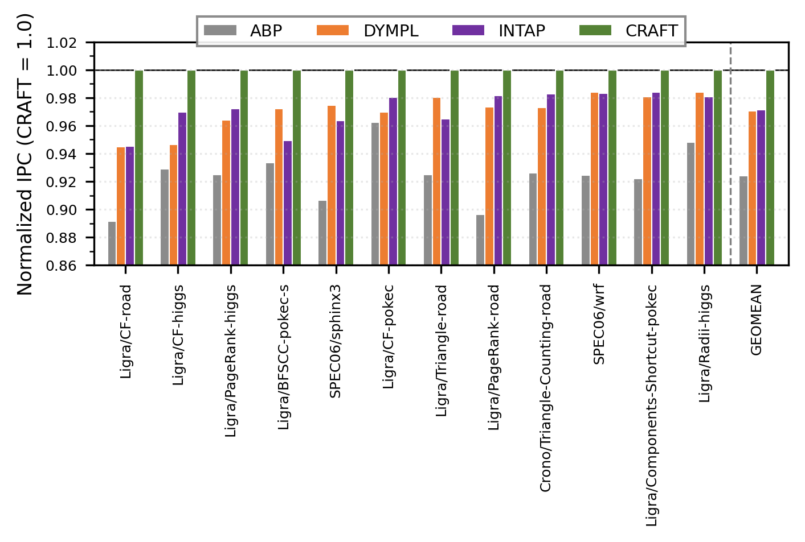
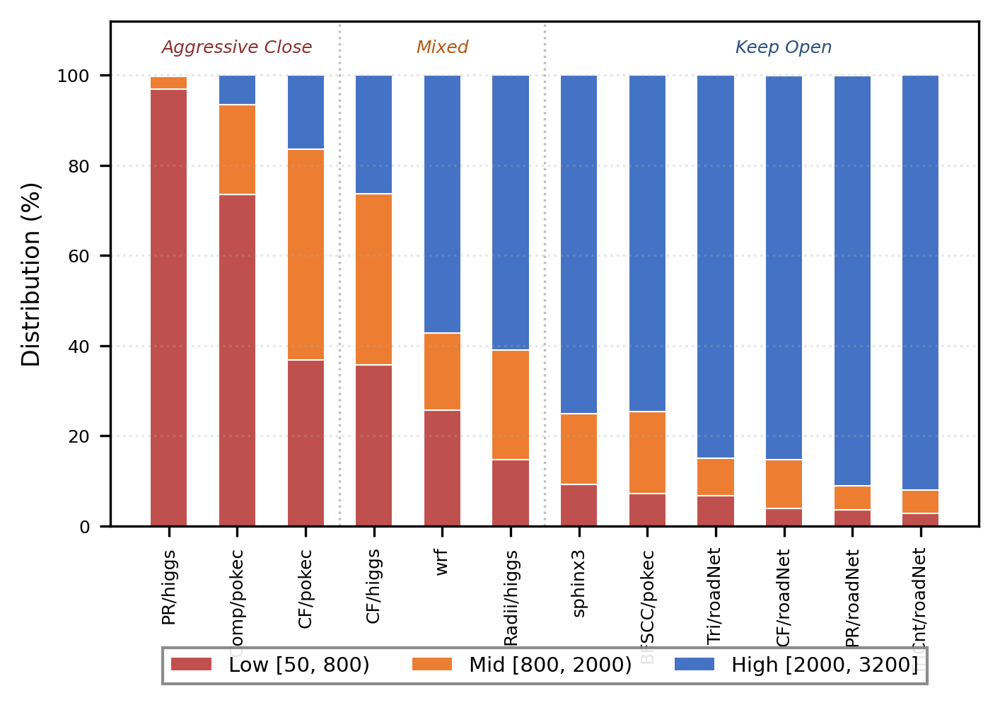
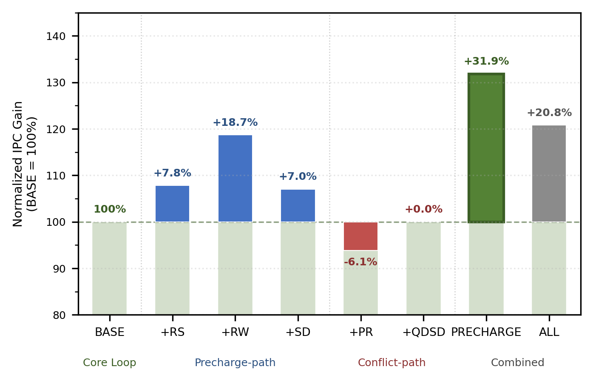

# CRAFT: Exploiting Precharge Cost Asymmetry for Adaptive DRAM Row Buffer Management

## Abstract

DRAM row buffer management presents a fundamental tradeoff between exploiting row buffer locality and minimizing conflict penalties. The optimal policy varies across workloads, execution phases, and individual address ranges. Existing adaptive schemes, however, face a persistent tension between hardware complexity and management effectiveness.

This paper presents CRAFT (Cost-driven Row-buffer Adaptive Feedback Timeout), a lightweight, feedback-driven row buffer management scheme. CRAFT exploits a fundamental cost asymmetry in timeout-based speculative precharge. The purpose of speculative precharge is to preserve row buffer locality while selectively closing idle rows. Both the precharge and the subsequent reactivation induced by a wrong precharge are entirely unnecessary and would not occur under the open-page scenario. A conflict, where the next access targets a different row, carries a fundamentally different cost. The precharge and activation are inherent to the access pattern regardless of the timeout decision, and only the opportunity to overlap precharge with idle bank cycles is lost. CRAFT translates this asymmetry into differentiated per-bank timeout adjustments. Wrong precharges escalate the timeout through exponential backoff, and conflicts de-escalate it with a smaller step proportional to the avoidable overhead. Beyond this core feedback loop, three precharge-path refinements further improve adaptation precision without additional hardware structures. The entire mechanism requires no prediction tables, feature extraction, or learned models.

We evaluate CRAFT using a cycle-accurate simulator across 12 memory-intensive workloads from graph analytics and scientific computing. CRAFT achieves geometric mean IPC improvements of 7.73%, 3.10%, and 2.84% over ABP, DYMPL, and INTAP, respectively, consistently outperforming all evaluated baselines. The total storage overhead is 140 bytes per channel, representing a 24× reduction relative to DYMPL and over 140× reduction relative to ABP. These results demonstrate that the cost asymmetry inherent in precharge outcomes provides a sufficient and lightweight foundation for effective row buffer management.

## 1. Introduction

Main memory latency remains a primary performance bottleneck in modern processor systems [Wulf+95, Mutlu+13, Hennessy+19].
A critical factor governing this latency is how the memory controller manages the *row buffer* in each DRAM bank, the internal sense-amplifier array that caches the most recently activated row.
Holding a row open (the *open-page* policy) maximizes the chance of serving subsequent accesses to the same row at low latency, but risks expensive conflicts when a different row is potentially needed. Closing immediately after each access (the *close-page* policy) eliminates such conflicts but forfeits all potential row locality.
This fundamental tradeoff makes row buffer management one of the most extensively studied yet persistently challenging aspects of memory controller design [Zhang+00, Jacob+07].

The optimal page policy varies across workloads, across execution phases, and even across targeted address ranges.
Neither open-page nor close-page dominates across all workloads. Open-page loses up to 11% IPC on workloads with frequent row buffer conflicts. Close-page sacrifices up to 28% IPC on workloads with high row buffer locality (Figure 1(a)).
Within a single program execution, row buffer hit rate shifts dramatically between program phases. The row buffer hit rate of mcf transitions from above 90% hit rate to below 10%, while PageRank follows the inverse trajectory (Figure 1(b)).
Beyond temporal variation, row buffer locality also differs substantially across banks within a single channel. Under the open-page policy, omnetpp exhibits a per-bank row buffer hit rate coefficient of variation of 1.51, indicating pronounced inter-bank disparity.
These observations suggest that effective row buffer management should adapt per bank and per execution phase.



**Figure 1.** (a) Normalized IPC of open-page and close-page policies across 12 memory-intensive workloads, normalized to the better static policy per workload. Neither static policy dominates across all workloads. (b) Row buffer hit rate across execution epochs under the open-page policy for four representative workloads. Each workload exhibits distinct phase transitions between high- and low-locality regimes.

Achieving per-bank, phase-adaptive row buffer management with low hardware overhead remains an open problem. Prior adaptive schemes have addressed aspects of this challenge but face a fundamental tradeoff between hardware complexity and adaptation precision.
ABP [Awasthi+11] requires approximately 20 KB per channel for per-row prediction tables. DYMPL [Rafique+22] employs a perceptron-based classifier with 3.39 KB per channel and requires machine-learning inference on the critical path. INTAP [Intel+06] adjusts a per-bank timeout using approximately 200 bytes per channel. It applies the same fixed step size to both wrong precharges and conflicts. This symmetric adjustment does not distinguish between the penalty induced by speculative precharge decisions and the inherent cost of the access pattern of the memory request streams.

This paper presents CRAFT (**C**ost-driven **R**ow-buffer **A**daptive **F**eedback-driven **T**imeout), a lightweight, feedback-driven row buffer management scheme. Timeout-based speculative precharge preserves row buffer locality and selectively closes idle rows. CRAFT refines this mechanism by exploiting the observation that the three possible precharge outcomes, namely *right*, *wrong*, and *conflict*, produce qualitatively different types of waste.
A right precharge correctly anticipates the end of row-level locality, and no bandwidth is wasted.
A wrong precharge is the most detrimental outcome. The purpose of speculative precharge is to preserve row buffer locality, yet a wrong precharge eliminates precisely this benefit. The subsequent access targets the same row and would have been served as a row buffer hit had the row remained open. Both the precharge and the reactivation are therefore entirely avoidable operations that would not occur under an open-page policy.
A conflict presents a fundamentally different situation. Because the target row differs from the currently open row, the precharge and activation are inherent to the access pattern. These operations would occur regardless of the timeout decision. The only benefit a well-timed precharge could provide is overlapping the precharge penalty with idle bank cycles. 
This asymmetry in failure cost is the foundation of CRAFT's feedback mechanism. A wrong precharge generates entirely avoidable overhead, while a conflict forfeits only a latency-hiding opportunity. CRAFT assigns correspondingly different adjustment magnitudes to each outcome. Wrong precharges escalate the timeout by exponentially increasing steps, guarding aggressively against further premature precharges. Conflicts reduce the timeout by a smaller, fixed step, reflecting the comparatively lower cost of a missed overlap. The resulting mechanism requires no prediction tables, feature extraction, or learned models.
With only 140 bytes of state per channel, CRAFT consistently outperforms all three baselines across 12 memory-intensive workloads.

The contributions of this paper are as follows:

1. We identify that the three outcomes of timeout-based speculative precharge produce qualitatively different types of waste. A wrong precharge introduces entirely avoidable overhead. A conflict incurs only the inherent cost of the access pattern. We propose CRAFT, a feedback-driven scheme that translates this cost asymmetry into differentiated timeout adjustments per bank. The entire mechanism requires only 140 bytes per channel.
2. Through ablation analysis, we demonstrate that feedback signals derived from precharge outcomes are sufficient for effective timeout adaptation in our evaluated setting, without requiring auxiliary runtime metrics.
3. We further show that incorporating conflict-path heuristics does not improve performance. Phase detection and queue occupancy signals introduce noise into the feedback loop rather than useful adaptation information.
4. We evaluate CRAFT using a cycle-accurate simulator with a DDR5-4800 configuration on 12 memory-intensive workloads including graph analytics and scientific computing. CRAFT consistently outperforms all three baselines with over 140x storage reduction compared to ABP.

## 2. Background

### 2.1 DRAM Row Buffer Fundamentals

Modern DRAM organizes each bank around a *row buffer*, an array of sense amplifiers that latches the most recently activated row. The latency of a memory access depends on the state of this row buffer. As illustrated in Figure 2(a), three scenarios arise:

- **Row buffer hit.** The requested data resides in the currently open row. The controller issues a column access command directly, incurring only tCAS.
- **Row buffer miss (closed bank).** No row is currently open. The controller activates the target row and then issues the column access. The total latency is tRCD + tCAS.
- **Row buffer conflict.** A different row is open. The controller must precharge, activate, and then issue the column access. This incurs tRP + tRCD + tCAS.

The disparity among these scenarios motivates row buffer management policies. An *open-page* policy keeps the row buffer open after an access. A *close-page* policy precharges the bank immediately. Neither dominates universally, as shown in Figure 1.

**Timeout-based speculative precharge.** Timeout-based policies occupy a middle ground between open-page and close-page behavior. The memory controller starts a countdown timer when a row becomes idle. If the timer expires before the next request, the controller speculatively precharges the bank. A short timeout approximates closed-page behavior. A long timeout approximates open-page behavior. This speculation produces one of four outcomes, illustrated in Figure 2(b):

1. **Right precharge.** The next request targets a different row. The speculative precharge correctly anticipated the end of row-level locality. The effective cost is zero.
2. **Wrong precharge.** The next request targets the same row. This access would have been served as a row buffer hit at zero additional latency. The controller must instead reactivate the row. Both the precharge and the reactivation are entirely unnecessary operations introduced by the controller's intervention. Neither would occur under the open-page baseline.
3. **Conflict.** The next request targets a different row, but the timeout has not yet expired. The controller must issue an on-demand precharge and then activate the target row. The activation cost is inherent to the access pattern. A correctly timed precharge would have overlapped tRP with idle bank cycles. Only this overlap opportunity is lost.
4. **Row buffer hit.** The next request targets the same row and arrives before the timeout. The row remains open at zero cost. A row buffer hit does not involve a precharge event. CRAFT's feedback loop therefore operates on the first three outcomes only.



**Figure 2: Row buffer access scenarios and timeout precharge outcomes.** (a) Three row buffer states at the time of a memory request. A hit incurs only tCAS. A miss requires tRCD + tCAS. A conflict pays tRP + tRCD + tCAS. (b) Four outcomes of timeout-triggered speculative precharge. CRAFT's feedback loop uses the three outcomes involving a precharge event.

The central challenge is to set the timeout value adaptively, per bank and over time, to match the evolving access pattern.

### 2.2 Limitations of Existing Adaptive Schemes

Several adaptive row buffer management schemes have been proposed. Table 1 summarizes three representative baselines.

**Table 1: Comparison of adaptive row buffer management baselines.**

| Scheme | Decision Mechanism                         | Storage per Channel | Critical-Path Computation           | Key Limitation                                |
| ------ | ------------------------------------------ | ------------------- | ----------------------------------- | --------------------------------------------- |
| ABP    | Per-row access count prediction table      | ~20 KB              | Table lookup + comparison           | Binary prediction; no outcome feedback        |
| DYMPL  | Perceptron + 512-entry page row table      | 3.39 KB             | Seven table lookups + six additions | Indirect features; no cost-aware adaptation   |
| INTAP  | Mistake counter with fixed adjustment step | ~200 B              | One comparison + one addition       | Symmetric fixed-step; no cost differentiation |

ABP [Awasthi+11] maintains a per-row access counter to predict the likelihood of future reaccesses to each row. This approach requires approximately 20 KB of storage per channel in the form of a set-associative prediction table. This cost is impractical for modern DDR5 controllers with 32 banks per channel. ABP frames row buffer management as a binary open-or-close prediction problem at per-row granularity. This formulation cannot capture bank-level phase transitions.

DYMPL [Rafique+22] employs a perceptron to combine seven extracted features and make open-or-close decisions at cluster boundaries. A 512-entry page row table accounts for 86.6% of the 3.39 KB per-channel storage. The perceptron learns empirical correlations among features. It does not directly observe the cost consequences of its precharge decisions.

INTAP adjusts timeout values per bank through a mistake counter with a fixed step size. At approximately 200 B per channel, INTAP achieves the lowest storage overhead among the three baselines. Its adjustment mechanism, however, is symmetric. A wrong precharge and a conflict trigger equal step magnitudes in opposite directions. This treatment does not distinguish between the entirely avoidable overhead of a wrong precharge and the inherent cost of a conflict.

These scheme-specific limitations differ in nature. All three baselines, however, share a deeper deficiency. None of them distinguishes precharge outcomes by the nature of the waste they produce. Timeout-based speculative precharge exists to preserve row buffer locality. A wrong precharge directly undermines this goal. Both the precharge command and the subsequent reactivation are entirely unnecessary. Neither operation would occur under the open-page baseline. The total avoidable overhead is tRP + tRCD. A conflict involves a request to a different row. The precharge and activation are inherent to the access pattern. A correctly timed precharge would have overlapped tRP with idle bank cycles. Only this overlap opportunity is avoidable. The avoidable component is therefore tRP. Under DDR5-4800 timing with tRP = tRCD = 40 cycles, the ratio of controller-attributable waste is (tRP + tRCD) / tRP = 2:1. This ratio has direct implications for timeout adaptation. The escalation step for wrong precharges should exceed the de-escalation step for conflicts. None of the three baselines incorporates this cost asymmetry into its adaptation logic.

## 3. CRAFT Design

This section presents CRAFT (**C**ost-driven **R**ow-buffer **A**daptive **F**eedback **T**imeout), a lightweight mechanism that exploits the cost asymmetry of precharge outcomes to adaptively manage DRAM row buffers.
Section 3.1 describes the core feedback loop.
Section 3.2 introduces three refinements that exploit additional precharge-path information.
Section 3.3 details the hardware implementation and quantifies storage overhead.

### 3.1 Core Feedback Loop

CRAFT maintains a per-bank timeout counter that specifies the number of idle cycles after the last column access before the memory controller speculatively issues a precharge command.
When a bank activation event occurs following a timeout-triggered precharge, the controller classifies the outcome into one of the three categories defined in Section 2.1: a wrong precharge indicates the timeout was too short, a conflict indicates it was too long, and a right precharge confirms the current value is appropriate.
These three outcomes provide a direct feedback signal for timeout adaptation.
CRAFT exploits the qualitatively different nature of waste among these outcomes to derive both the direction and the magnitude of each adjustment.

CRAFT adjusts the per-bank timeout value in response to these outcomes according to three design principles.

**(a) Cost-driven asymmetric step sizes.**
Speculative precharge exists to preserve row buffer locality. A wrong precharge directly undermines this goal. Both the precharge command and the subsequent reactivation are entirely unnecessary operations. Neither would occur under the open-page baseline. The total controller-attributable waste is tRP + tRCD. A conflict involves a different target row. The precharge and activation are inherent to the access pattern regardless of the timeout decision. A correctly timed precharge would have overlapped tRP with idle bank cycles. The controller-attributable waste is therefore limited to the missed overlap opportunity of tRP. The ratio of avoidable overhead is (tRP + tRCD) / tRP. Under our DDR5-4800 configuration (tRP = tRCD = 40 cycles), this ratio evaluates to 2:1. CRAFT mirrors this ratio in its adjustment magnitudes. The escalation step for wrong precharges uses a base value of BASE_STEP = 50 cycles. This value is chosen to be slightly larger than tRP (40 cycles), ensuring each escalation produces an observable timeout change. The de-escalation step for conflicts is scaled by the factor tRP / (tRP + tRCD), yielding 25 cycles under this configuration.

This asymmetry creates a deliberate upward bias. Under equal frequencies of wrong precharges and conflicts, each escalation exceeds the subsequent de-escalation and produces a net timeout increase. This bias reflects the design principle of speculative precharge. The mechanism exists to protect row buffer locality. A wrong precharge actively destroys that locality and therefore warrants a stronger corrective response. T_MAX bounds this upward bias. Once the timeout reaches 3200 cycles, further escalation is clamped. Conflicts and right-streak de-escalation (Section 3.2a) then provide downward pressure to restore balance.

**(b) Exponential backoff.**
CRAFT applies exponential backoff to consecutive wrong precharges by left-shifting the base step:

> step = BASE_STEP × 2^min(reopen_streak, SHIFT_CAP)

The reopen_streak counter tracks consecutive wrong precharges, is capped at seven (three bits), and resets to zero upon a right precharge or a conflict. This mechanism enables rapid convergence during sustained high-locality phases. The timeout can reach the upper bound within a small number of feedback events.

**(c) Continuous adjustment range.**
CRAFT adjusts the timeout continuously within a bounded range [T_MIN, T_MAX] = [50, 3200] cycles. T_MIN is set to match BASE_STEP, preventing degeneration into a pure closed-page policy. T_MAX is set to accommodate sustained high-locality phases and prevents the row buffer from remaining indefinitely open. The feedback loop can therefore converge to any intermediate value for fine-grained adaptation to varying degrees of row locality. CRAFT's exponential backoff traverses the full timeout range in as few as six escalation events.

Algorithm 1 presents the complete pseudocode of the core feedback loop.

**Algorithm 1: CRAFT Core Feedback Loop**

```
On each bank ACT event:
  if prev_closed_by_timeout:
    if new_row == prev_row:                    ▷ Wrong precharge
      step ← BASE_STEP << min(reopen_streak, SHIFT_CAP)
      timeout ← timeout + step                ▷ Escalate
      reopen_streak ← min(reopen_streak + 1, 7)
      right_streak ← 0
    else:
      if was_ondemand_precharge:               ▷ Conflict
        step ← BASE_STEP × tRP / (tRP + tRCD)
        timeout ← timeout − step              ▷ De-escalate
        reopen_streak ← 0
        right_streak ← 0
      else:                                    ▷ Right precharge
        reopen_streak ← 0
        right_streak ← right_streak + 1    ▷ See Section 3.2(a)
    timeout ← clamp(timeout, T_MIN, T_MAX)
```

Figure 3 illustrates the feedback loop schematically.
The three precharge outcomes feed back to the per-bank timeout counter with asymmetric step sizes, forming a closed-loop control mechanism that continuously adapts to the prevailing row-level access pattern.



**Figure 3: CRAFT core feedback loop. On each bank activation following a timeout-triggered precharge, the controller classifies the precharge outcome and adjusts the per-bank timeout accordingly. Wrong precharges escalate the timeout with exponential backoff. Conflicts de-escalate with a cost-proportional step. Right precharges confirm the current timeout value.**

### 3.2 Precharge-Path Refinements

The core feedback loop provides the primary adaptive capability.
The following three refinements exploit additional information available along the precharge outcome path to improve adaptation precision.
All three are lightweight and introduce no additional hardware structures beyond simple counters.

**(a) Right Streak De-escalation (RS).**
After four or more consecutive right precharges, the timeout decrements by half the conflict de-escalation step (conflict_step / 2).
This gradual reduction prevents timeout values from remaining at elevated levels after a high-locality phase has ended.
Without RS, a bank that transitions from a high-locality phase to a low-locality phase would maintain an unnecessarily large timeout until a conflict explicitly triggers de-escalation.
RS provides a proactive path for timeout reduction in the absence of explicit conflict signals.
RS adds three bits per bank for the right_streak counter.

**(b) Read/Write Cost Differentiation (RW).**
Read and write wrong precharges differ in performance impact. A read wrong precharge directly stalls the processor pipeline. The delayed data return blocks retirement of dependent instructions. A write wrong precharge is absorbed by the write buffer and incurs minimal pipeline impact.
Across our evaluated workloads, read operations account for the majority of wrong precharge events.
CRAFT exploits this asymmetry by halving the escalation step for write wrong precharges and doubling the de-escalation step for read conflicts.
RW requires no additional storage. The command type is already available to the memory controller.

**(c) Streak Decay (SD).**
Each right precharge decrements the reopen_streak counter by one (with a floor at zero), allowing the escalation magnitude to decay gradually rather than persisting at a historically elevated level.
Without SD, a burst of consecutive wrong precharges could leave reopen_streak at a high value, causing a single wrong precharge much later to trigger a disproportionately large escalation step.
SD ensures that escalation aggressiveness reflects recent behavior rather than historical extremes.
SD requires no additional storage, as it operates on the existing reopen_streak counter.

Section 5.4 validates the effectiveness of these three refinements through an ablation study.

### 3.3 Hardware Implementation

Table 2 itemizes the per-bank storage required by CRAFT.
Each bank maintains five fields totaling 35 bits: a 12-bit timeout counter covering the [50, 3200] range, two 3-bit streak counters for exponential backoff and right-streak tracking, a 16-bit previous row address (2^16 = 65,536 rows per bank) used for outcome classification, and a single flag bit indicating whether the most recent precharge was triggered by a timeout.
For a DDR5-4800 configuration with 32 banks per channel (8 bank groups × 4 banks per group), the total storage overhead is 140 bytes per channel.

**Table 2: CRAFT Per-Bank Storage Breakdown**

| Field                        | Width             | Description                                |
| ---------------------------- | ----------------- | ------------------------------------------ |
| timeout_value                | 12 bits           | Current timeout value [50, 3200]           |
| reopen_streak                | 3 bits            | Consecutive wrong precharge counter [0, 7] |
| right_streak                 | 3 bits            | Consecutive right precharge counter [0, 7] |
| prev_row                     | 16 bits           | Previously activated row address           |
| prev_closed_by_timeout       | 1 bit             | Timeout precharge indicator                |
| **Per-bank total**     | **35 bits** |                                            |
| **32 banks / channel** | **140 B**   |                                            |

CRAFT requires no specialized hardware structures.
The critical-path computation consists of a single comparison (classifying the precharge outcome by comparing the requested row address against prev_row) and a single addition or subtraction (adjusting the timeout value by the computed step).

## 4. Methodology

### 4.1 Simulation Infrastructure

We evaluate CRAFT using trace-driven microarchitectural simulator ChampSim [Gober+22] integrated with cycle-accurate DRAM simulator DRAMSim3 [Li+20]. The details of our simulation configuration are shown in Table 3.

**Table 3: Simulation Configuration**

| Component           | Parameter                                | Value                     |
| ------------------- | ---------------------------------------- | ------------------------- |
| **Processor** | Frequency                                | 4 GHz                     |
|                     | Pipeline width                           | 6                         |
|                     | ROB entries                              | 350                       |
|                     | Branch predictor                         | TAGE-SC-L                 |
| **Caches**    | L1 (I/D): Size / Associativity / Latency | 32 KB / 8-way / 4 cycles  |
|                     | L2: Size / Associativity / Latency       | 1 MB / 8-way / 10 cycles  |
|                     | LLC: Size / Associativity / Latency      | 4 MB / 16-way / 20 cycles |
| **DRAM**      | Standard                                 | DDR5-4800                 |
|                     | Channels / Ranks / Banks per channel     | 4 / 1 / 32                |
|                     | Rows per bank                            | 65,536                    |
|                     | tCL / tRCD / tRP (DRAM cycles)           | 40 / 40 / 40              |
|                     | Address mapping                          | rorababgchco              |
|                     | Command queue (per bank)                 | 8 entries                 |

### 4.2 Workloads

We select 12 memory-intensive workloads as benchmark-input pairs from three benchmark suites. Table 4 summarizes the workloads and their inputs.

LIGRA [Shun+13] and CRONO [Ahmad+15] are widely recognized benchmark suites specialized for graph applications. LIGRA provides a lightweight shared-memory parallel framework for graph traversal and computation. From LIGRA, we select six representative graph algorithms, including Collaborative Filtering, PageRank, BFS-based Connected Components, Components-Shortcut, Triangle enumeration, and Radii estimation. From CRONO, we include Triangle-Counting.

SPEC CPU2006 [SPEC06] is a widely used benchmark suite for evaluating processor performance. We select two memory-intensive scientific computing workloads, sphinx3 and wrf, which feature stencil-like access patterns with periodic row revisitation.

As input for the graph algorithms, we use three real-world graphs from the SNAP dataset [Leskovec+16]: roadNet-CA (1.97M vertices, 2.77M edges), higgs (456K vertices, 14.8M edges), and soc-pokec (1.6M vertices, 30M edges).

To extract representative program phases, we profile each workload using SimPoint [Sherwood+02] with maxK set to 30 and an interval size of 100 million instructions. For each selected simulation point, the cache hierarchy is warmed up with 20 million instructions, and performance is measured over the subsequent 80 million instructions.

**Table 4: Workload Suite**

| Suite                 | Benchmark                              | Input                        | Category             |
| --------------------- | -------------------------------------- | ---------------------------- | -------------------- |
| LIGRA [Shun+13]       | Collaborative Filtering (CF)           | roadNet-CA, higgs, soc-pokec | Graph traversal      |
|                       | PageRank                               | higgs, roadNet-CA            | Graph traversal      |
|                       | BFS-based Connected Components (BFSCC) | soc-pokec                    | Graph traversal      |
|                       | Components-Shortcut                    | soc-pokec                    | Graph traversal      |
|                       | Triangle                               | roadNet-CA                   | Graph analysis       |
|                       | Radii                                  | higgs                        | Graph analysis       |
| CRONO [Ahmad+15]      | Triangle-Counting                      | roadNet-CA                   | Graph analysis       |
| SPEC CPU2006 [SPEC06] | sphinx3                                | ref                          | Scientific computing |
|                       | wrf                                    | ref                          | Scientific computing |

### 4.3 Baselines

We compare CRAFT against three representative adaptive row buffer management schemes. Section 6 discusses these approaches in the broader context of prior work.

**ABP** [Awasthi+11] predicts the number of accesses a row will receive and keeps the row open until the predicted count is reached.

**DYMPL** [Rafique+22] employs a perceptron model trained on memory access features to select the row buffer management policy for each request.

**INTAP** [Intel06] precharges each row upon expiration of a per-bank idle timeout and adjusts the timeout through a mistake counter.

### 4.4 Metrics

We report the following metrics to evaluate both system-level performance and DRAM-level effectiveness.

**Instructions Per Cycle (IPC)** serves as the primary performance metric. We report per-workload IPC improvement relative to each baseline.

**Read Row Buffer Hit Rate** is defined as the proportion of read requests served directly from the currently activated row without incurring an additional row activation. Since write requests are considered complete once cached in the write buffer, their row buffer hit rates have negligible impact on observed performance. We therefore report read row buffer hit rates exclusively.

**Average Read Latency** quantifies the mean DRAM service time for read requests, measured in DRAM clock cycles. Lower read latency correlates with higher IPC, as read requests lie on the critical path of dependent memory request chains.

## 5. Evaluation

This section evaluates CRAFT across four dimensions: system-level IPC performance (Section 5.1), DRAM-level performance analysis (Section 5.2), timeout adaptation behavior (Section 5.3), and an ablation study of individual design components (Section 5.4).

### 5.1 IPC Performance

Figure 4 presents the per-workload IPC improvement of CRAFT over each of the three baselines. CRAFT achieves a geometric mean IPC improvement of 7.73% over ABP, 3.10% over DYMPL, and 2.84% over INTAP across all 12 workloads. CRAFT achieves positive IPC improvement on all 12 workloads relative to all three baselines. The improvements range from 1.61% to 12.20%.



**Figure 4: Normalized IPC across 12 workloads (CRAFT = 1.0). CRAFT consistently outperforms all three baselines. The geometric mean improvements are 7.73%, 3.10%, and 2.84% over ABP, DYMPL, and INTAP, respectively.**

**Graph traversal workloads.** CF, PageRank, BFSCC, and Components-Shortcut exhibit the largest improvements over ABP (7.1% to 12.2%). These algorithms undergo pronounced phase transitions between exploration and convergence stages. Such transitions cause abrupt shifts in row-level locality. CRAFT's exponential backoff mechanism enables rapid adaptation to such transitions. Under sustained locality, CRAFT rapidly converges to keeping row buffers open. This behavior accounts for the largest IPC gains in the workload suite.

**Graph analysis workloads.** Triangle enumeration and Radii exhibit mixed locality patterns. CRAFT's per-bank adaptation tracks the evolving access behavior of these workloads. Row-level locality builds up progressively over the execution. CRAFT's feedback loop tracks this progressive locality shift without any explicit phase detection mechanism. Section 5.3 provides a detailed analysis of the corresponding timeout distribution.

**Scientific computing workloads.** sphinx3 and wrf feature stencil-like access patterns with periodic row revisitation. CRAFT correctly identifies the dominant high-locality phases. These workloads exhibit alternating transitions between data-intensive and computation-intensive phases. CRAFT tracks these rapid shifts and adjusts timeout values accordingly. Section 5.3 examines the timeout distribution in detail.

### 5.2 DRAM-Level Performance Analysis

To understand the source of CRAFT's IPC improvement, we examine two DRAM-level metrics.
CRAFT achieves the highest read row buffer hit rate on all 12 workloads, surpassing the best-performing baseline by an average of 5.62 percentage points. The improvements are most pronounced on workloads with strong but phase-varying row locality. CF/roadNet-CA (+9.25 pp), PageRank/roadNet-CA (+9.12 pp), and sphinx3 (+7.76 pp) exhibit the largest gains.
CRAFT also achieves the lowest average read latency on all 12 workloads. The average reduction is 2.74% compared to the best-performing baseline. The latency improvements are largest on workloads with the largest read hit rate improvements. Sphinx3 (-5.86%), CF/roadNet-CA (-5.66%), and PageRank/roadNet-CA (-5.29%) show the most significant reductions. This correlation is expected. Additional row buffer hits eliminate the precharge and activation overhead.
Write row buffer hit rates remain nearly identical across all four policies. The performance advantage of CRAFT therefore originates primarily from the read path. This observation is consistent with CRAFT's read/write cost differentiation design.

### 5.3 Timeout Distribution

Figure 5 presents the timeout value distribution for each workload. For analysis, we partition the timeout range into three bins: Low [50, 800), Mid [800, 2000), and High [2000, 3200]. The boundaries correspond to approximately one quarter and two thirds of the full range, separating aggressive-close, moderate, and keep-open behavior. Three distinct adaptation patterns emerge.



**Figure 5: Timeout value distribution across 12 workloads, sorted from aggressive-close (left) to keep-open (right). CRAFT adapts to three distinct behavioral regimes without any explicit mode selection.**

**Aggressive Close.** PageRank/higgs concentrates 96.9% of timeout observations in the Low range. 33.5% of observations fall below 100 cycles. The higgs graph's irregular power-law degree distribution yields poor row-level locality for PageRank's vertex-centric iterations. CRAFT responds by aggressively reducing timeout values to minimize conflict penalties. Components-Shortcut/pokec exhibits a similar pattern. The short-lived exploratory accesses of connected component algorithms drive this behavior.

**Gradual Transition.** CF/higgs distributes timeout values across all three ranges. This aggregate distribution is the time-integrated result of a gradual shift from Low-dominated to High-dominated behavior. Early execution phases produce frequent row conflicts and concentrate timeout values in the Low range. Later phases develop stronger row-level locality and shift timeout values into the Mid and High ranges. CRAFT's feedback loop captures this evolving locality without any explicit phase detection.

**Keep Open.** The roadNet-CA workloads concentrate timeout values overwhelmingly in the High range. The road network graph's spatially ordered vertex numbering produces strong row-level locality. CRAFT's exponential backoff mechanism rapidly elevates timeout values to the upper bound after observing consecutive wrong precharges.

A particularly revealing comparison is PageRank on two different inputs. RoadNet-CA yields 90.9% in the High range. Higgs yields 96.9% in the Low range. This demonstrates that CRAFT's adaptation is driven by the runtime row-level access pattern, a joint function of algorithm and input data, rather than by the algorithm identity alone. Importantly, all three adaptation modes produce positive IPC improvements over every baseline. CRAFT is effectively adaptive rather than biased toward any single static policy.

### 5.4 Ablation Study

We conduct an ablation study to quantify the contribution of each design component. Figure 6 compares eight CRAFT variants. Table 5 defines each variant. Each variant's geometric mean IPC gain over the best baseline is normalized to the core feedback loop's gain.

**Table 5: Ablation Study Variants**

| Variant                                 | Components                 | Description                                              |
| --------------------------------------- | -------------------------- | -------------------------------------------------------- |
| BASE                                    | Core loop only             | Cost-asymmetric step sizes + exponential backoff         |
| RS                                      | BASE + Right Streak        | Timeout de-escalation after consecutive right precharges |
| RW                                      | BASE + Read/Write          | Differentiated step sizes by read/write command type     |
| SD                                      | BASE + Streak Decay        | Gradual decay of reopen_streak on right precharges       |
| PRECHARGE                               | BASE + RS + RW + SD        | All three precharge-path refinements combined            |
| PR (Phase Reset)                        | BASE + Phase Reset         | Reset timeout to initial value on conflict               |
| QDSD (Queue-Depth Scaled De-escalation) | BASE + Queue-Depth Scaling | Scale de-escalation step by command queue occupancy      |
| ALL                                     | PRECHARGE + PR + QDSD      | All precharge-path and conflict-path signals combined    |



**Figure 6: Ablation study of CRAFT design components. Green: core feedback loop and the recommended PRECHARGE configuration. Blue: individual precharge-path enhancements. Red: individual conflict-path signals. The dashed line marks the BASE level.**

**The core feedback loop is the primary contributor.** The BASE variant implements only the cost-asymmetric step sizes and exponential backoff. BASE accounts for 76% of the final improvement. This confirms that differentiating precharge outcomes by the nature of their waste provides a sufficiently rich feedback signal for effective timeout adaptation, even without additional refinements.

**Precharge-path refinements provide complementary gains.** The PRECHARGE variant adds three precharge-path enhancements, namely RS, RW, and SD. All three individual enhancements exceed the BASE level. RW is the strongest individual enhancement at 118.7% of BASE's gain. RS and SD reach 107.8% and 107.0%, respectively. The three enhancements synergize effectively. PRECHARGE (RS+RW+SD) achieves 131.9% of BASE's gain. RS and SD prevent timeout stagnation. RW adjusts the step magnitudes based on command type.

**Conflict-path signals did not improve performance.** PR and QDSD individually reach 93.9% and 100.0% of BASE's gain, respectively. Adding both to the PRECHARGE configuration yields the ALL variant at 120.8%, an 11.1 percentage point drop from PRECHARGE's 131.9%. These conflict-path signals attempt to extract additional information from conflict events. Phase resets undo progress accumulated during stable phases. Queue-depth scaling introduces a second adaptation signal and can conflict with the cost-driven adjustments. This result validates a key design principle. The three-way classification of precharge outcomes encodes sufficient feedback information. Further decomposition of conflict events yields diminishing returns.

## 6. Related Work

**Row buffer management with static policies.**
JEDEC [DDR+345] standards define a per-command auto-precharge mechanism, upon which all adaptive row buffer management schemes are constructed. Kaseridis et al. [Kaseridis+11] proposed Minimalist Open-page. This approach limits the number of row buffer hits per activation through an address mapping that distributes column address bits across the bank address field. The fixed hit limit is determined at design time and does not adapt across workloads or execution phases. Unlike static policies or fixed address mappings, CRAFT continuously adjusts the idle timeout per bank to track workload phase changes and inter-bank locality differences at runtime.

**Predictor-based row buffer management.**
Park and Park [Park+03] maintained per-bank two-bit saturating counters to predict row hits and decide whether to issue auto-precharge commands. Stankovic and Milenkovic [Stankovic+05] proposed a cascaded close-page predictor combining a zero-live-time predictor with a dead-time predictor. Their analysis noted the cost asymmetry between incorrectly closing and incorrectly keeping a row open. This asymmetry was not exploited to drive adaptive adjustment. CRAFT derives asymmetric adjustment magnitudes directly from DRAM timing parameters. Awasthi et al. [Awasthi+11] proposed ABP. ABP's storage overhead and per-row granularity limitations are detailed in Section 2. Ghasempour et al. [Ghasempour+16] proposed HAPPY. HAPPY exploits the fixed mapping between physical address bits and DRAM address to replace per-row monitoring with per-address-bit monitoring. HAPPY is orthogonal to CRAFT's cost-asymmetric timeout adaptation. CRAFT's per-bank state of 35 bits per bank already achieves minimal storage overhead.

**Timeout-based adaptive schemes.**
INTAP [INTEL+06] adjusts timeout values through a per-bank mistake counter with a fixed step size. Its symmetric adjustment mechanism does not distinguish between controller-induced waste and inherent access cost. This limitation is analyzed in Section 2. The fixed step size further constrains adaptation granularity and limits responsiveness to rapid program phase transitions. CRAFT derives step sizes from the ratio of avoidable overhead between the two failure modes and applies exponential backoff for faster convergence.

**Learning-based approaches.**
Ipek et al. [Ipek+08] applied reinforcement learning to DRAM command scheduling. The approach requires 32 KB of SRAM for function approximation tables and a multi-stage pipelined learning engine operating at processor frequency. DYMPL [Rafique+22] models page policy as binary classification using perceptron learning. Its storage and critical-path computation overhead are detailed in Section 2. These learning-based approaches share a common reliance on indirect features as proxies for the optimal precharge decision. CRAFT instead uses the precharge outcome itself as the sole feedback signal. This design eliminates the need for feature engineering, model training, or associative table lookups.

## 7. Limitations

This study evaluates CRAFT in a single-core configuration. Multi-core workloads introduce inter-thread bank contention and may affect the feedback quality of per-bank timeout adaptation. The 2:1 ratio of avoidable overhead underlying CRAFT's asymmetric step sizes derives from the DDR5-4800 timing parameters used in our evaluation (tRP = tRCD). Different DRAM standards or speed grades with unequal tRP and tRCD values would yield a different ratio. Our evaluation covers 12 workloads with a substantial proportion of graph applications. A broader workload coverage and energy analysis remain directions for future investigation.

## 8. Conclusion

This paper presents CRAFT, a lightweight feedback-driven row buffer management scheme that exploits the inherent cost asymmetry of precharge outcomes. The key observation is that the two failure modes of timeout-based speculative precharge produce qualitatively different types of waste. A wrong precharge introduces entirely avoidable overhead by destroying the row buffer locality the mechanism is designed to protect. A conflict incurs only the inherent cost of the access pattern. This asymmetry can directly govern both the direction and magnitude of timeout adjustments without requiring complex learning models.

CRAFT utilizes this observation through a per-bank feedback loop that combines cost-asymmetric step sizes with exponential backoff. This design achieves rapid convergence during high-locality program phases. Our ablation study shows that precharge-path refinements improve adaptation precision. Incorporating conflict-path signals did not improve performance. These results suggest that precharge penalty classification provides sufficient information for effective precharge speculation in our evaluated setting.

Across 12 memory-intensive workloads, CRAFT achieves IPC improvements of 7.73%, 3.10%, and 2.84% over ABP, DYMPL, and INTAP, respectively. CRAFT improves the average read row buffer hit rate by 5.62 percentage points over the best baseline and reduces average read latency by 2.74%. CRAFT requires only 140 B of storage per channel with no specialized hardware structures. We expect CRAFT's per-bank state organization to be compatible with DRAM architectural modifications and memory scheduling optimizations. Extending CRAFT to multi-core configurations, alternative DRAM standards with different timing ratios, and energy-aware optimization remains future work.
