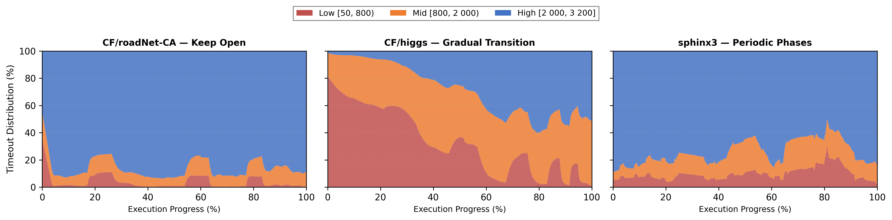
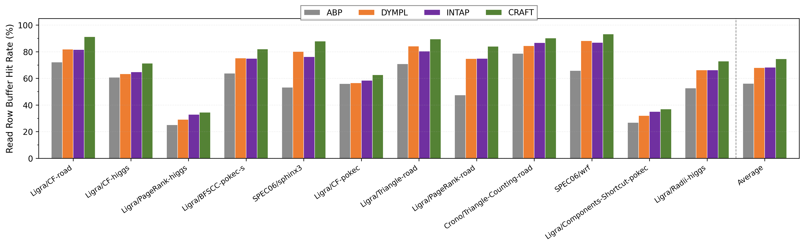
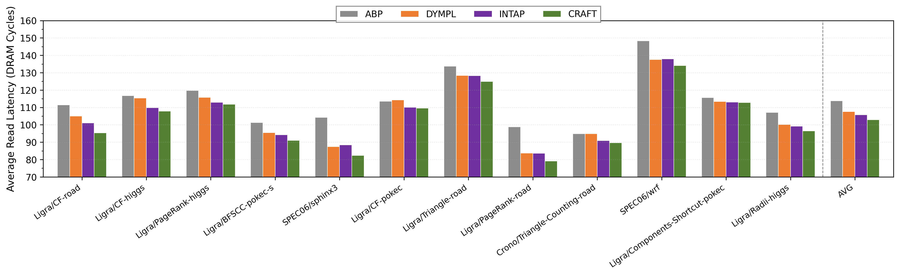
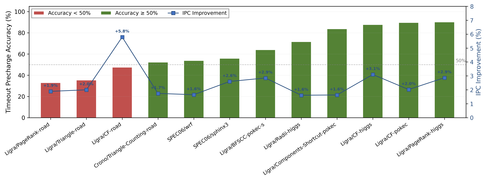

## 5. Evaluation

This section presents a comprehensive evaluation of CRAFT across four dimensions, namely system-level IPC performance (Section 5.1), DRAM-level behavioral analysis (Section 5.2), timeout adaptation behavior (Section 5.3), and an ablation study of individual design components (Section 5.4).

### 5.1 IPC Performance

Figure 7 presents the per-benchmark IPC improvement of CRAFT over each of the three baselines. CRAFT achieves a geometric mean IPC improvement of 7.73% over ABP, 3.10% over DYMPL, and 2.84% over INTAP across all 12 benchmarks. Notably, CRAFT outperforms every baseline on every benchmark. The improvements range from 1.61% to 12.20%.

**Figure 7: Normalized IPC across 12 benchmarks (CRAFT = 1.0). CRAFT consistently outperforms all three baselines. The geometric mean improvements are 7.73%, 3.10%, and 2.84% over ABP, DYMPL, and INTAP, respectively.**

**Graph traversal workloads.** The graph traversal benchmarks, namely CF, PageRank, BFSCC, and Components-Shortcut, exhibit the largest improvements over ABP (7.1% to 12.2%). These algorithms undergo pronounced phase transitions between exploration and convergence stages. Such transitions cause abrupt shifts in row-level locality. CRAFT's exponential backoff mechanism enables rapid adaptation to such transitions. Figure 8 (left) illustrates this process on CF/roadNet-CA. The High range dominates the distribution throughout execution. The Low and Mid ranges rise occasionally but remain minor. This pattern confirms that CRAFT rapidly converges to keeping row buffers open under sustained locality.

**Graph analysis workloads.** Triangle enumeration and Radii exhibit mixed locality patterns. CRAFT's per-bank adaptation tracks the evolving access behavior of these workloads. Figure 8 (center) illustrates this process on CF/higgs. The distribution undergoes a gradual transition from Low-dominated to High-dominated over the full execution. In the first quarter of the program execution, the Low range accounts for 60–80% of timeout observations. The Low range then steadily decreases over the remainder of execution. The Mid and High ranges grow correspondingly. By the final quarter, the High range reaches 50% while the Low range drops below 15%. This gradual transition reflects the progressive buildup of row-level locality during algorithm convergence. CRAFT's feedback loop tracks this evolution without any explicit phase detection mechanism.

**Scientific computing workloads.** The sphinx3 and wrf benchmarks feature stencil-like access patterns with periodic row revisitation. CRAFT correctly identifies the dominant high-locality phases and converges timeout values to the High range for 75% and 57% of the execution on sphinx3 and wrf, respectively. Figure 8 (right) illustrates this adaptation on sphinx3. The High range dominates with little variation during the first 40% of execution. The distribution becomes substantially more volatile afterward. The Low and Mid ranges surge repeatedly into significant fractions of the total. These fluctuations reflect alternating transitions between data-intensive and computation-intensive phases. CRAFT tracks these rapid shifts and adjusts timeout values accordingly.

**Figure 8: Timeout distribution evolution over execution time for three representative benchmarks. Each vertical slice shows the proportion of timeout values in the Low (red), Mid (orange), and High (blue) ranges at a given execution epoch. The left panel exhibits persistent High-range dominance throughout execution under sustained row-level locality. Brief spikes of Low and Mid values appear periodically and correspond to transient locality disruptions during graph traversal phase transitions. The center panel shows a gradual transition from a Low-dominated distribution to a High-dominated distribution over the full program execution. The right panel maintains a stable High-dominated phase in the first 40% of execution and then exhibits volatile fluctuations across all three ranges in the remainder.**

### 5.2 DRAM-Level Analysis

To understand the source of CRAFT's IPC improvement, we examine two DRAM-level metrics, namely read row buffer hit rate and average read latency.

#### 5.2.1 Read Row Buffer Hit Rate

Figure 9 presents the read row buffer hit rate for CRAFT and all three baselines across the 12 benchmarks. CRAFT achieves the highest read hit rate on every benchmark and surpasses the best-performing baseline by an average of 5.62 percentage points. The improvements are most pronounced on workloads with strong but phase-varying row locality. CF/roadNet-CA (+9.25%), PageRank/roadNet-CA (+9.12%), and sphinx3 (+7.76%) exhibit the largest gains.

**Figure 9: Read row buffer hit rate across 12 benchmarks. CRAFT achieves the highest hit rate on every benchmark. The average improvement over the best-performing baseline is 5.62 percentage points.**

In contrast, write row buffer hit rates are nearly identical across all four policies. Differences remain within 1% The performance advantage of CRAFT therefore originates entirely from the read path. This observation is consistent with CRAFT's cost-driven design. The read/write cost differentiation (RW) enhancement applies stronger de-escalation on read conflicts and effectively keeps row buffers open longer for access streams dominated by read commands.

#### 5.2.2 Average Read Latency

Figure 10 presents the average read latency in DRAM clock cycles. CRAFT achieves the lowest read latency on all 12 benchmarks. The average reduction is 2.74% compared to the best-performing baseline. The latency improvements are largest on benchmarks with the largest read hit rate improvements. Sphinx3 (−5.86%), CF/roadNet-CA (−5.66%), and PageRank/roadNet-CA (−5.29%) show the most significant reductions. This correlation is expected as additional row buffer hits eliminate the precharge and activation overhead.

**Figure 10: Average read latency across 12 benchmarks. CRAFT achieves the lowest read latency on every benchmark. The average read latency reduction over the best-performing baseline is 2.74%.**

### 5.3 Timeout Behavior Analysis

This section analyzes the internal behavior of CRAFT's feedback loop. The analysis addresses two complementary aspects, timeout precharge accuracy and timeout value distribution.

#### 5.3.1 Timeout Precharge Accuracy

Across the 12 benchmarks, CRAFT achieves an aggregate timeout precharge accuracy of 84.7%. In other words, 84.7% of all timeout-initiated precharges correctly anticipate that the next access to the same bank will target a different row. The feedback loop of CRAFT converges timeout values to effective levels. These levels meaningfully distinguish rows likely to be reaccessed from other rows.

**Figure 11: Timeout precharge accuracy and IPC improvement over the best baseline for each benchmark, sorted by accuracy in ascending order. Red bars indicate benchmarks with accuracy below 50%. The orange line traces the IPC improvement. The three roadNet-CA benchmarks achieve the lowest accuracy yet produce the largest IPC gains, illustrating the self-correcting nature of the feedback loop. The 84.7% aggregate accuracy reported in the text is weighted by the total number of timeout precharge events per benchmark, not an arithmetic mean of per-benchmark accuracy values.**

An instructive finding emerges from the benchmarks with the lowest accuracy. The roadNet-CA workloads (PageRank/roadNet-CA at 32.8%, Triangle/roadNet-CA at 35.3%, CF/roadNet-CA at 47.4%) exhibit accuracy below 50%, yet they achieve the largest IPC improvements (+1.89% to +5.79% over the best baseline). This seemingly paradoxical result has a specific explanation. Low accuracy in these cases reflects a systematic bias toward escalation. Wrong precharges outnumber correct ones. The feedback loop progressively increases timeout values as a result. The loop thereby learns these workloads require long timeouts and effectively converges toward an open-page policy. The resulting high read hit rates deliver substantial performance gains. This demonstrates the self-correcting nature of the feedback loop. The majority of individual timeout decisions may be retrospectively incorrect, yet the overall adaptation direction remains beneficial.

#### 5.3.2 Timeout Distribution

Figure 12 presents the timeout value distribution for each benchmark. The values fall into three ranges, namely Low [50, 800), Mid [800, 2000), and High [2000, 3200]. Three distinct adaptation patterns emerge.

**Figure 12: Timeout value distribution across 12 benchmarks, sorted from aggressive-close (left) to keep-open (right). CRAFT adapts to three distinct behavioral regimes without any explicit mode selection.**

**Aggressive Close.** PageRank/higgs concentrates 96.9% of timeout observations in the Low range. 33.5% of observations fall below 100 cycles. The higgs graph's irregular power-law degree distribution yields poor row-level locality for PageRank's vertex-centric iterations. CRAFT responds by aggressively reducing timeout values to minimize conflict penalties. Components-Shortcut/pokec exhibits a similar pattern. The short-lived exploratory accesses of connected component algorithms drive this behavior.

**Gradual Transition.** CF/higgs distributes timeout values across all three ranges. This aggregate distribution is the time-integrated result of a gradual shift from Low-dominated to High-dominated behavior. Early execution phases produce frequent row conflicts and concentrate timeout values in the Low range. Later phases develop stronger row-level locality and shift timeout values into the Mid and High ranges. CRAFT's feedback loop captures this evolving locality without any explicit phase detection.

**Keep Open.** The roadNet-CA benchmarks  concentrate timeout values overwhelmingly in the High range. The road network graph's spatially ordered vertex numbering produces strong row-level locality. CRAFT's exponential backoff mechanism rapidly elevates timeout values to the upper bound after observing consecutive wrong precharges.

A particularly revealing comparison is PageRank on two different inputs. RoadNet-CA yields 90.9% in the High range. Higgs yields 96.9% in the Low range. This demonstrates that CRAFT's adaptation is driven by the runtime row-level access pattern, a joint function of algorithm and input data, rather than by the algorithm identity alone. Importantly, all three adaptation modes produce positive IPC improvements over every baseline. CRAFT is genuinely adaptive rather than biased toward any single static policy.

### 5.4 Ablation Study

We conduct an ablation study to quantify the contribution of each design component. Figure 13 compares eight CRAFT variants. Each variant's geometric mean IPC gain over the best baseline is normalized to the core feedback loop's gain. Three precharge-path enhancements (RS, RW, SD) and two conflict-path signals (PR, QDSD) each add one refinement to BASE. Two combined configurations further aggregate multiple enhancements.

**Figure 13: Ablation study of CRAFT design components. Each bar shows the variant's IPC gain over the best baseline. The gain of BASE defines the 100% reference. Green: core feedback loop and the recommended PRECHARGE configuration. Blue: individual precharge-path enhancements. Red: individual conflict-path signals. Gray: the ALL configuration including all five enhancements. The dashed line marks the BASE level. All three precharge-path enhancements exceed 100%. Both conflict-path signals fall at or below 100%. PRECHARGE (RS+RW+SD) achieves the highest relative improvement at 131.9%.**

**The core feedback loop is the dominant contributor.** The BASE variant implements only the cost-asymmetric step sizes and exponential backoff.  BASE accounts for 76% of the final improvement. This confirms that the precharge outcome cost asymmetry provides a sufficiently rich feedback signal for effective timeout adaptation, even without additional refinements.

**Precharge-path refinements provide complementary gains.** The PRECHARGE variant adds three precharge-path enhancements, namely Right Streak de-escalation (RS), Read/Write cost differentiation (RW), and Streak Decay (SD). All three individual enhancements exceed the BASE level in Figure 13. RW is the strongest individual enhancement at 118.7% of BASE's gain.  RS and SD reach 107.8% and 107.0%, respectively. The three enhancements synergize effectively. PRECHARGE (131.9%) exceeds the sum of any pairwise combination. RS and SD prevent timeout stagnation. RW adjusts the step magnitudes based on command type.

**Conflict-path signals are detrimental.** PR and QDSD individually reach 93.9% and 100.0% of BASE's gain, respectively. Adding both to the PRECHARGE configuration yields the ALL variant at 120.8%. These conflict-path signals attempt to extract additional information from conflict events. Specifically, they capture the execution phase of the conflict and the current command queue depth. This information interferes with the convergence dynamics of the core feedback loop. Phase resets undo progress from stable phases. Queue-depth scaling introduces a second adaptation signal and can conflict with the cost-driven adjustments. This result validates a key design principle. The three-way classification of precharge outcomes (right, wrong, conflict) encodes sufficient feedback information. Further decomposition of conflict events yields diminishing returns.
