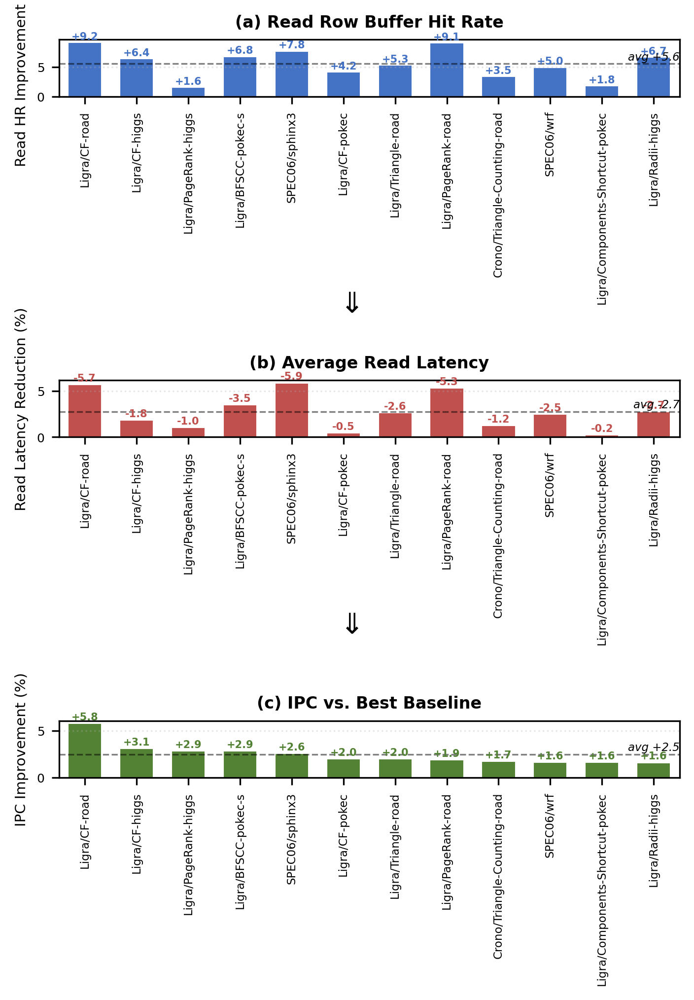

## 5. Evaluation

This section presents a comprehensive evaluation of CRAFT across
four dimensions, namely system-level IPC performance (Section 5.1),
DRAM-level behavioral analysis (Section 5.2), timeout adaptation
behavior (Section 5.3), and an ablation study of individual
design components (Section 5.4).

### 5.1 IPC Performance

Table 3 reports the per-benchmark IPC improvement of CRAFT
over each of the three baselines.
CRAFT achieves a geometric mean IPC improvement of
7.73% over ABP, 3.10% over DYMPL, and 2.84% over INTAP
across all 12 benchmarks.
Notably, CRAFT outperforms every baseline on every
benchmark. Individual improvements range from
1.61% to 12.20%.

**Table 3: Per-Benchmark IPC Improvement of CRAFT over Baselines**

| # | Benchmark | vs ABP | vs DYMPL | vs INTAP |
|---|-----------|--------|----------|----------|
| 1 | Ligra/CF-road | +12.20% | +5.81% | +5.79% |
| 2 | Ligra/CF-higgs | +7.67% | +5.67% | +3.10% |
| 3 | Ligra/PageRank-higgs | +8.14% | +3.73% | +2.87% |
| 4 | Ligra/BFSCC-pokec | +7.12% | +2.85% | +5.33% |
| 5 | SPEC06/sphinx3 | +10.28% | +2.60% | +3.78% |
| 6 | Ligra/CF-pokec | +3.89% | +3.10% | +2.02% |
| 7 | Ligra/Triangle-road | +8.12% | +2.00% | +3.65% |
| 8 | Ligra/PageRank-road | +11.56% | +2.71% | +1.89% |
| 9 | Crono/TriCnt-road | +7.97% | +2.78% | +1.74% |
| 10 | SPEC06/wrf | +8.19% | +1.65% | +1.72% |
| 11 | Ligra/Comp-pokec | +8.47% | +1.95% | +1.63% |
| 12 | Ligra/Radii-higgs | +5.48% | +1.61% | +1.97% |
| | **GEOMEAN** | **+7.73%** | **+3.10%** | **+2.84%** |

Figure 5 presents the normalized IPC across all benchmarks
and the geometric mean. CRAFT is normalized to 1.0.
The consistent gap between CRAFT and all three baselines
spans diverse workload categories. The improvement is not
confined to a specific access pattern and generalizes across
graph traversal, graph analysis, and scientific computing workloads.

**Figure 5: Normalized IPC across 12 benchmarks (CRAFT = 1.0).
CRAFT consistently outperforms all three baselines. The geometric
mean improvements are 7.2%, 3.0%, and 2.8% over ABP, DYMPL, and
INTAP, respectively.**

**Graph traversal workloads.**
The graph traversal benchmarks, namely CF, PageRank, BFSCC, and
Components-Shortcut, exhibit the largest improvements over ABP
(7.1% to 12.2%).
These algorithms undergo pronounced phase transitions between
exploration and convergence stages. Such transitions cause
abrupt shifts in row-level locality.
CRAFT's exponential backoff mechanism enables rapid adaptation
to such transitions. On roadNet-CA inputs, timeout values converge
to the High range (2000–3200 cycles) for 85–92% of the
execution and correctly keep row buffers open during
high-locality convergence phases.
ABP's per-row prediction table, by contrast, stores stale
access counts. These counts become misleading after phase
transitions and result in the largest performance gap among
all baselines.

**Graph analysis workloads.**
Triangle enumeration and Radii exhibit mixed locality patterns
with substantial inter-bank behavioral heterogeneity.
CRAFT's per-bank adaptation captures this heterogeneity
precisely.
For example, on CF/higgs, the timeout distribution is nearly
uniform across the Low, Mid, and High ranges (35.7%, 38.0%, and
26.3%, respectively). This distribution reflects the diverse
row reuse patterns across different banks within a single execution.
Global or coarse-grained adaptive schemes cannot achieve this
level of differentiation. They apply a single policy decision
across all banks.

**Scientific computing workloads.**
The sphinx3 and wrf benchmarks feature stencil-like access
patterns with periodic row revisitation.
CRAFT correctly identifies the dominant high-locality phases
and converges timeout values to the High range for 75% and
57% of the execution on sphinx3 and wrf, respectively.
The improvement over ABP is particularly pronounced on sphinx3
(+10.28%). Speech recognition workloads alternate between
computational and data-access phases. ABP's prediction table
thrashes under these alternating phases.

### 5.2 DRAM-Level Analysis

To understand the source of CRAFT's IPC improvement, we
examine two DRAM-level metrics, namely read row buffer hit rate
and average read latency. We demonstrate a clear causal chain
from hit rate improvement through latency reduction to IPC gain.

#### 5.2.1 Read Row Buffer Hit Rate

Table 4 reports the read row buffer hit rate for CRAFT
and all three baselines across the 12 benchmarks.
CRAFT achieves the highest read hit rate on every benchmark
and surpasses the best-performing baseline by an average of
5.62 percentage points.
The improvements are most pronounced on workloads with strong
but phase-varying row locality. CF/roadNet-CA (+9.25 pp),
PageRank/roadNet-CA (+9.12 pp), and sphinx3 (+7.76 pp)
exhibit the largest gains.

**Table 4: Read Row Buffer Hit Rate (%)**

| # | Benchmark | CRAFT | ABP | DYMPL | INTAP | vs Best BL |
|---|-----------|-------|-----|-------|-------|------------|
| 1 | CF/roadNet-CA | 91.15 | 72.13 | 81.90 | 81.56 | +9.25 pp |
| 2 | CF/higgs | 71.30 | 60.81 | 63.29 | 64.86 | +6.44 pp |
| 3 | PageRank/higgs | 34.46 | 25.13 | 29.16 | 32.87 | +1.59 pp |
| 4 | BFSCC/pokec | 82.03 | 63.80 | 75.20 | 74.96 | +6.83 pp |
| 5 | sphinx3 | 87.85 | 53.21 | 80.09 | 76.17 | +7.76 pp |
| 6 | CF/pokec | 62.64 | 55.96 | 56.60 | 58.48 | +4.15 pp |
| 7 | Triangle/roadNet-CA | 89.44 | 70.89 | 84.09 | 80.46 | +5.35 pp |
| 8 | PageRank/roadNet-CA | 83.97 | 47.47 | 74.83 | 74.85 | +9.12 pp |
| 9 | TriCnt/roadNet-CA | 90.17 | 78.59 | 84.48 | 86.71 | +3.46 pp |
| 10 | wrf | 93.21 | 65.85 | 88.23 | 86.93 | +4.98 pp |
| 11 | Comp/pokec | 36.90 | 26.78 | 31.98 | 35.08 | +1.82 pp |
| 12 | Radii/higgs | 72.88 | 52.64 | 66.20 | 66.17 | +6.68 pp |
| | **Average** | | | | | **+5.62 pp** |

In contrast, write row buffer hit rates are nearly identical
across all four policies. Differences remain within one
percentage point. The performance advantage of CRAFT therefore
originates entirely from the read path.
This observation is consistent with CRAFT's cost-driven design.
The read/write cost differentiation (RW) enhancement applies
stronger de-escalation on read conflicts and effectively keeps
row buffers open longer for read-dominant access streams.

#### 5.2.2 Average Read Latency

Table 5 reports the average read latency in DRAM clock cycles.
CRAFT achieves the lowest read latency on all 12 benchmarks.
The average reduction is 2.74% compared to the
best-performing baseline.
The latency improvements are largest on benchmarks with the
largest read hit rate improvements. Sphinx3 (−5.86%),
CF/roadNet-CA (−5.66%), and PageRank/roadNet-CA (−5.29%)
show the most significant reductions. This pattern is expected.
Additional row buffer hits eliminate the precharge and
activation overhead.

**Table 5: Average Read Latency (DRAM Cycles)**

| # | Benchmark | CRAFT | ABP | DYMPL | INTAP | vs Best BL |
|---|-----------|-------|-----|-------|-------|------------|
| 1 | CF/roadNet-CA | 95.32 | 111.47 | 104.99 | 101.04 | −5.66% |
| 2 | CF/higgs | 107.86 | 116.80 | 115.43 | 109.88 | −1.84% |
| 3 | PageRank/higgs | 111.80 | 119.71 | 115.73 | 112.97 | −1.03% |
| 4 | BFSCC/pokec | 90.99 | 101.30 | 95.41 | 94.28 | −3.49% |
| 5 | sphinx3 | 82.31 | 104.28 | 87.43 | 88.41 | −5.86% |
| 6 | CF/pokec | 109.56 | 113.56 | 114.27 | 110.05 | −0.45% |
| 7 | Triangle/roadNet-CA | 124.94 | 133.72 | 128.34 | 128.32 | −2.63% |
| 8 | PageRank/roadNet-CA | 79.15 | 98.78 | 83.75 | 83.58 | −5.29% |
| 9 | TriCnt/roadNet-CA | 89.70 | 94.89 | 94.80 | 90.83 | −1.24% |
| 10 | wrf | 134.11 | 148.35 | 137.52 | 137.86 | −2.48% |
| 11 | Comp/pokec | 112.85 | 115.68 | 113.44 | 113.10 | −0.22% |
| 12 | Radii/higgs | 96.51 | 107.06 | 100.19 | 99.21 | −2.72% |
| | **Average** | | | | | **−2.74%** |

#### 5.2.3 Causal Chain: Hit Rate to IPC

Figure 6 juxtaposes three metrics across all 12 benchmarks,
namely read hit rate improvement, read latency reduction,
and IPC gain over the best baseline.
The three metrics exhibit a consistent directional
relationship. Higher read hit rates translate to lower read
latencies. Lower read latencies in turn translate to higher IPC.
On average, a 5.62 pp improvement in read hit rate yields
a 2.74% reduction in read latency and a 2.48% improvement
in IPC.

**Figure 6: Causal chain from DRAM-level improvements to
system-level performance. (a) Read row buffer hit rate improvement
over the best baseline. (b) Corresponding read latency reduction.
(c) Resulting IPC improvement. The three metrics are directionally
consistent across all 12 benchmarks.**

The amplification ratio from hit rate to IPC is sublinear.
IPC is influenced by multiple factors beyond DRAM
latency, such as cache hit rates, branch prediction accuracy,
and instruction-level parallelism.
Nevertheless, for the memory-intensive benchmarks in our
evaluation suite, the DRAM read path constitutes a significant
performance bottleneck. The causal chain attributes
CRAFT's IPC gains to improved row buffer management at the
DRAM level.

### 5.3 Timeout Behavior Analysis

This section examines the internal behavior of CRAFT's
feedback loop through two complementary lenses, namely
timeout precharge accuracy and timeout value distribution.

#### 5.3.1 Timeout Precharge Accuracy

Across the 12 selected benchmarks, CRAFT achieves an aggregate
timeout precharge accuracy of 84.7%. In other words, 84.7% of all
timeout-initiated precharges correctly anticipate that the next
access to the same bank will target a different row.
Over the full set of 62 benchmarks, the aggregate accuracy
rises to 89.5%.
This substantially exceeds the 50% random baseline. The feedback
loop converges timeout values to effective levels. These levels
meaningfully distinguish rows likely to be reaccessed from
rows likely to remain idle.

An instructive finding emerges from the benchmarks with the
lowest accuracy.
The roadNet-CA workloads (PageRank/roadNet-CA at 32.8%,
Triangle/roadNet-CA at 35.3%, CF/roadNet-CA at 47.4%) exhibit
accuracy below 50%, yet they achieve the largest IPC improvements
(+1.89% to +5.79% over the best baseline).
This seemingly paradoxical result has a specific explanation.
Low accuracy in these cases reflects a systematic bias toward
escalation. Wrong precharges outnumber correct ones. The feedback
loop progressively increases timeout values as a result.
The loop thereby learns these workloads require long
timeouts and effectively converges toward an open-page policy.
The resulting high read hit rates deliver substantial
performance gains.
This demonstrates the self-correcting nature of the
feedback loop. The majority of individual timeout decisions
may be retrospectively incorrect, yet the overall adaptation
direction remains beneficial.

#### 5.3.2 Timeout Distribution

Figure 7 presents the timeout value distribution for each
benchmark. The values fall into three ranges, namely
Low [50, 800), Mid [800, 2000), and High [2000, 3200].
Three distinct adaptation patterns emerge.

**Figure 7: Timeout value distribution across 12 benchmarks,
sorted from aggressive-close (left) to keep-open (right).
CRAFT adapts to three distinct behavioral regimes without
any explicit mode selection.**

**Aggressive Close.**
PageRank/higgs concentrates 96.9% of timeout observations
in the Low range. 33.5% of observations fall below 100 cycles.
The higgs graph's irregular power-law degree distribution
yields poor row-level locality for PageRank's vertex-centric
iterations. CRAFT responds by aggressively reducing timeout
values to minimize conflict penalties.
Components-Shortcut/pokec exhibits a similar pattern
(Low: 73.5%). The short-lived exploratory accesses of
connected component algorithms drive this behavior.

**Balanced.**
CF/higgs distributes timeout values relatively uniformly
across the three ranges (Low: 35.7%, Mid: 38.0%, High: 26.3%).
This distribution reflects pronounced inter-bank heterogeneity.
Within a single execution, some banks serve dense matrix rows
with high reuse and drive their timeout to the High range.
Others handle sparse vector operations with frequent
row conflicts and drive their timeout to the Low range.
CRAFT's per-bank adaptation captures this intra-workload
diversity. Global policies cannot achieve this level of
differentiation.

**Keep Open.**
The roadNet-CA benchmarks (Triangle-Counting: 92.0%,
PageRank: 90.9%, CF: 85.2%) concentrate timeout values
overwhelmingly in the High range.
The road network graph's spatially ordered vertex numbering
produces strong row-level locality. CRAFT's exponential
backoff mechanism rapidly elevates timeout values to the
upper bound after observing consecutive wrong precharges.

A particularly revealing comparison is PageRank on two
different inputs. RoadNet-CA yields 90.9% in the High range.
Higgs yields 96.9% in the Low range.
This demonstrates that CRAFT's adaptation is driven by the
runtime row-level access pattern, a joint function of
algorithm and input data, rather than by the algorithm identity
alone.
Importantly, all three adaptation modes produce positive
IPC improvements over every baseline. CRAFT is genuinely
adaptive rather than biased toward any single
static policy.

### 5.4 Ablation Study

We conduct an ablation study to quantify the contribution
of each design component.
Table 6 reports the geometric mean IPC improvement over
INTAP for three CRAFT variants.

**Table 6: Ablation Study — Geometric Mean IPC Improvement over INTAP**

| Variant | Components | GEOMEAN vs INTAP | Delta vs BASE |
|---------|-----------|-----------------|---------------|
| BASE | Core feedback loop | +0.653% | — |
| PRECHARGE | BASE + RS + RW + SD | +0.861% | +0.208 pp |
| ALL | PRECHARGE + PR + QDSD | +0.789% | +0.136 pp |

**The core feedback loop is the dominant contributor.**
The BASE variant implements only the cost-asymmetric
step sizes and exponential backoff. It already achieves 76%
of the final GEOMEAN improvement (0.653% out of 0.861%).
This confirms that the precharge outcome cost asymmetry
provides a sufficiently rich feedback signal for effective
timeout adaptation, even without additional refinements.

**Precharge-path refinements provide complementary gains.**
The PRECHARGE variant adds three precharge-path enhancements,
namely Right Streak de-escalation (RS), Read/Write cost
differentiation (RW), and Streak Decay (SD). These enhancements
yield an additional 0.208 pp improvement over BASE.
RW is the strongest individual enhancement. It contributes
the most wins (49 out of 62 benchmarks) and the highest
single-enhancement GEOMEAN (+0.775%).
The three enhancements synergize effectively. PRECHARGE
(+0.861%) exceeds the sum of any pairwise combination.
RS and SD prevent timeout stagnation. RW adjusts the step
magnitudes based on command type.

**Conflict-path signals are detrimental.**
Adding phase reset (PR) and queue-depth-scaled de-escalation
(QDSD) to the PRECHARGE configuration reduces the GEOMEAN
by 0.072 pp (from +0.861% to +0.789%).
These conflict-path signals attempt to extract additional
information from conflict events. Specifically, they capture
the execution phase of the conflict and the current command
queue depth.
However, this information interferes with the adaptation
rhythm of the core feedback loop. Phase resets undo progress
from stable phases. Queue-depth scaling introduces a second
adaptation signal and can conflict with the cost-driven
adjustments.
This result validates a key design principle. The three-way
classification of precharge outcomes (right, wrong, conflict)
encodes sufficient feedback information. Further
decomposition of conflict events yields diminishing returns.
