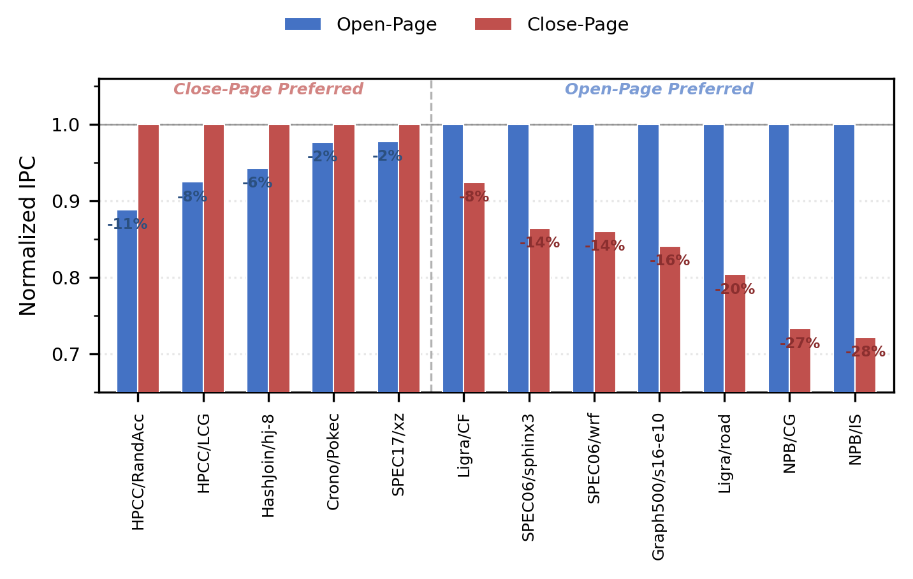
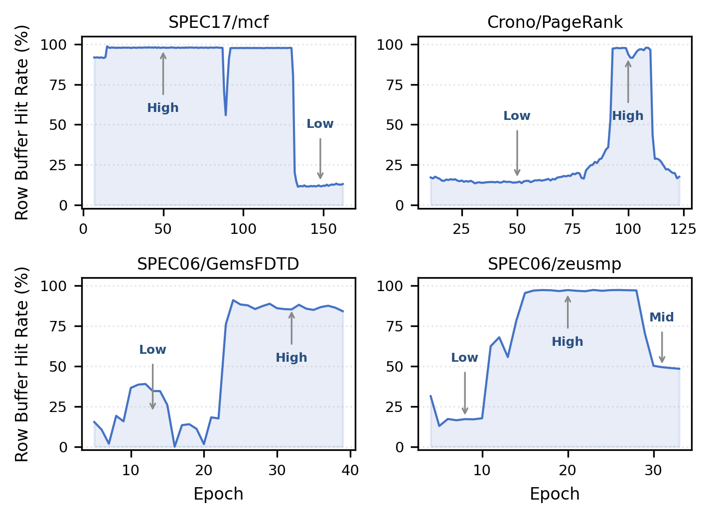
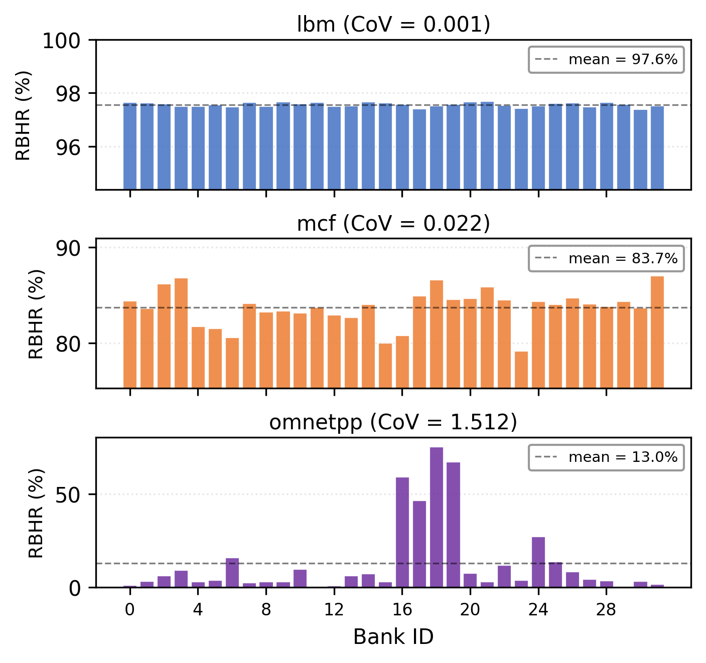

## 1. Introduction

Main memory latency remains a primary performance bottleneck in modern processor systems.
A critical factor governing this latency is how the memory controller manages the *row buffer* in each DRAM bank, the internal sense-amplifier array that caches the most recently activated row.
Holding a row open (the *open-page* policy) maximizes the chance of serving subsequent accesses to the same row at low latency, but risks expensive conflicts when a different row is potentially needed; closing immediately after each access (the *close-page* policy) eliminates such conflicts but forfeits all potential row locality.
This fundamental tradeoff makes row buffer management one of the most extensively studied yet persistently challenging aspects of memory controller design.

The optimal page policy varies across workloads, across execution phases, and even across individual banks.
Neither open-page nor close-page dominates across all benchmarks. Open-page loses up to 11% IPC on workloads with frequent row buffer conflicts, while close-page sacrifices 27–30% on workloads with high row buffer locality (Figure 1).
Within a single execution, row buffer locality also shifts dramatically between program phases. mcf transitions from above 90% hit rate to below 10%, while PageRank follows the inverse trajectory (Figure 2).
Beyond temporal variation, row buffer locality also differs substantially across banks within a single channel. Figure 3 shows per-bank row buffer hit rates under open-page for three representative benchmarks. While lbm exhibits relatively uniform hit rates across banks, mcf and omnetpp show pronounced inter-bank disparity, with omnetpp reaching a coefficient of variation of 1.51.
These observations suggest that effective row buffer management should adapt at fine spatial and temporal granularity, specifically per bank and per execution phase.

**Figure 1.** Normalized IPC of open-page and close-page policies across 12 memory-intensive benchmarks, normalized to the better static policy per benchmark. Among the close-page-preferred benchmarks (left), the open-page policy loses up to 11% IPC; among the open-page-preferred benchmarks (right), the close-page policy loses up to 28% IPC. Neither static policy dominates across all workloads.

**Figure 2.** Row buffer hit rate across execution epochs under the open-page policy for four representative benchmarks. Each benchmark exhibits distinct phase transitions between high- and low-locality regimes, demonstrating that row buffer behavior is not stationary within a single program execution.

**Figure 3.** Per-bank row buffer hit rate (RBHR) under the open-page policy for three benchmarks with varying inter-bank heterogeneity. Each bar represents the RBHR of one of 32 banks within a single channel, and the dashed line indicates the cross-bank mean. Note that the y-axis range differs across subplots to reveal per-bank variation at each scale. The coefficient of variation (CoV) ranges from 0.001 (lbm, near-uniform) to 1.512 (omnetpp, highly heterogeneous), indicating that a uniform per-channel policy cannot capture bank-level locality differences.

Prior adaptive schemes have targeted this challenge but face a persistent tradeoff between hardware complexity and adaptation quality.
ABP [Awasthi+11] maintains a per-row access count prediction table to decide whether each row should remain open or be closed after access.
ABP requires approximately 20 KB of storage per channel, an overhead that scales with the number of tracked rows. DYMPL [Rafique+22] employs a  perceptron-based classifier coupled with a 512-entry page residency table to predict the optimal policy. DYMPL reduces storage to 3.39 KB per channel, but 86.6% of this budget is consumed by the residency table. Moreover, each prediction requires seven table lookups followed by six additions on the critical path, which complicates hardware implementation and increases prediction latency.
INTAP [Ghasemp+16] takes a timeout-based approach. Specifically, the memory controller starts a per-bank countdown timer after each access and  precharges the bank when its timer expires. INTAP adaptively adjusts this timeout value using a mistake counter, requiring approximately 200 bytes per channel.
However, INTAP applies the same fixed step size to both wrong precharges and row conflicts despite their differing latency costs.
This lack of cost awareness limits the convergence behavior of INTAP's feedback mechanism.

This paper presents CRAFT (**C**ost-driven **R**ow-buffer **A**daptive **F**eedback driven **T**imeout), a lightweight, feedback-driven row buffer management scheme. CRAFT builds on the observation that the three possible outcomes of a timeout-based speculative precharge, namely *right*, *wrong*, and *conflict*, carry inherently asymmetric performance costs.
A right precharge closes the row before a request to a different row arrives, incurring no wasted latency.
A wrong precharge closes the row prematurely, necessitating a re-activation when the same row is accessed again.
A conflict arises when the timeout is set too long and the open row blocks an arriving request to a different row. This incurs both precharge and activation penalties.
Because conflicts carry a higher penalty than wrong precharges, CRAFT uses this cost asymmetry to drive differentiated timeout adjustments. Wrong precharges escalate the timeout value through exponentially increasing steps to preserve row locality. Conflicts de-escalate the timeout value with a smaller, cost-proportional step. This simple feedback mechanism requires no prediction tables, feature extraction, or learned models.
With only 140 bytes of state storage per channel, CRAFT outperforms all three baselines. CRAFT achieves geometric mean IPC improvements of 7.73%, 3.10%, and 2.84% over ABP, DYMPL, and INTAP, respectively, across 12 memory-intensive benchmarks.

The contributions of this paper are as follows:

1. We identify that the three outcomes of timeout-based speculative precharge encode asymmetric performance costs. Based on this observation, we propose CRAFT, a feedback-driven scheme that translates this cost asymmetry into differentiated timeout adjustments per bank. The entire mechanism requires only 140 bytes per channel.
2. Through ablation analysis, we demonstrate that feedback signals derived directly from precharge outcomes are sufficient for effective timeout adaptation, while signals drawn from conflict-path heuristics such as phase detection and queue occupancy degrade performance. This finding validates that the cost asymmetry of precharge outcomes alone provides a complete feedback basis for row buffer management, without requiring auxiliary runtime metrics.
3. We evaluate CRAFT using cycle-accurate ChampSim–DRAMSim3 co-simulation with a DDR5-4800 configuration on 12 memory-intensive benchmarks including graph analytics and scientific computing. CRAFT achieves geometric mean IPC improvements of 7.73%, 3.10%, and 2.84% over ABP, DYMPL, and INTAP, respectively. CRAFT requires 24× less storage than DYMPL and over 140× less than ABP.
